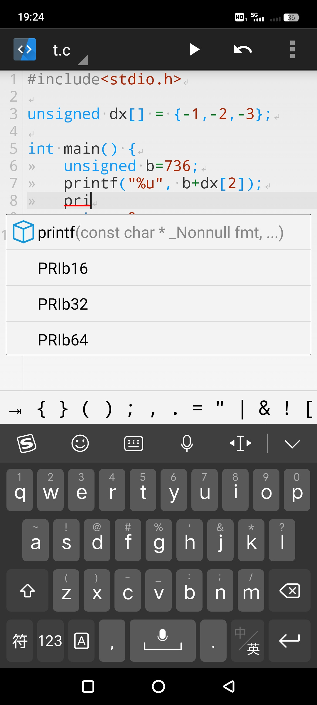

# TermuC

  

TermuC 是一个简单的 C/C++ IDE，采用 Termux 作为后台。项目基于 [MrIkso/CodeEditor](//github.com/MrIkso/CodeEditor)

## 下载

- Artfacts in [Github Actions](//github.com/RainbowC0/TermuC/actions)
- [F-Droid](//f-droid.org/packages/cn.rbc.termuc)

## 截图

## 技术原理

本应用利用 `com.termux.RUN_COMMAND` 调用 Termux 执行编译命令，并利用 `netcat` 运行 `clangd` 语言服务器，通过 TCP Socket 建立持续的 I/O 通道，提供代码诊断和补全功能。

## 特性

- [x] 代码高亮
- [x] 自动补全
- [x] 格式化
- [x] 代码诊断
- [x] 编译选项
- [x] 暗主题
- [x] 调试
- [x] 项目管理
- [ ] 工作空间

## Wiki

- [*初始化*(很重要)](//github.com/RainbowC0/TermuC/wiki/Setup)
- [使用方法](//github.com/RainbowC0/TermuC/wiki/Usage)
